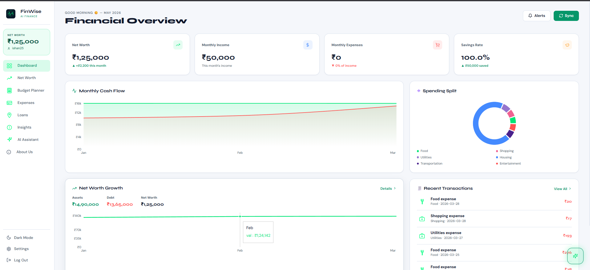
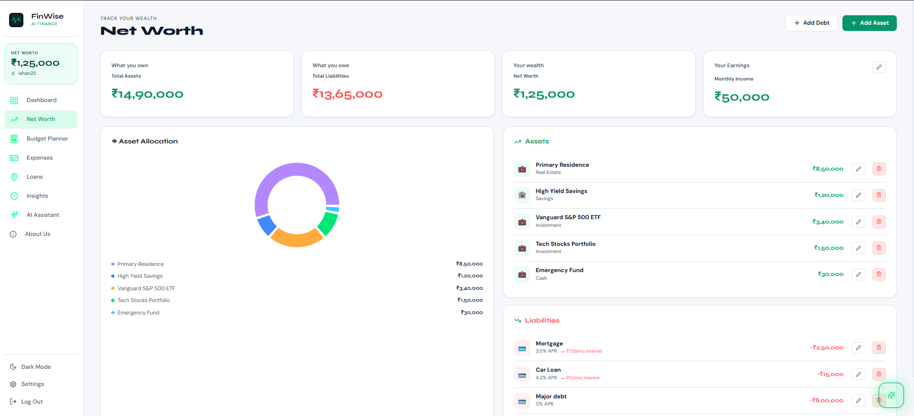
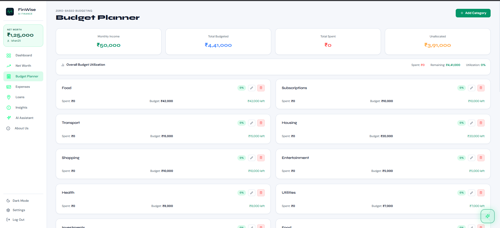
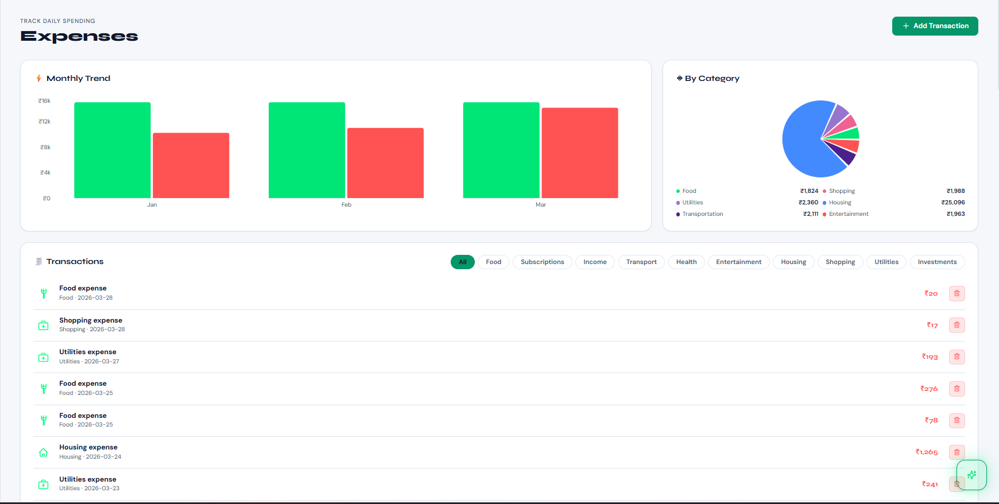
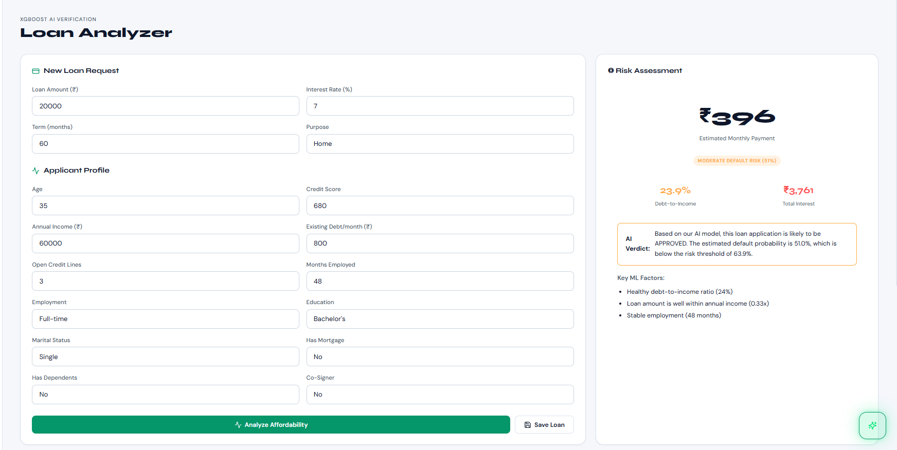
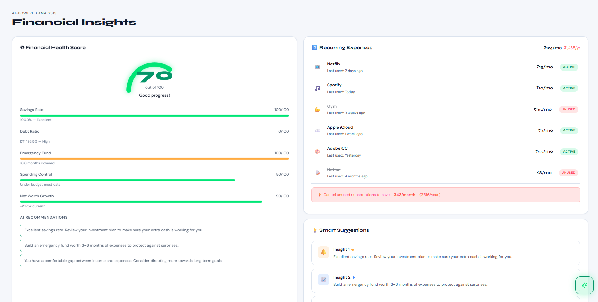
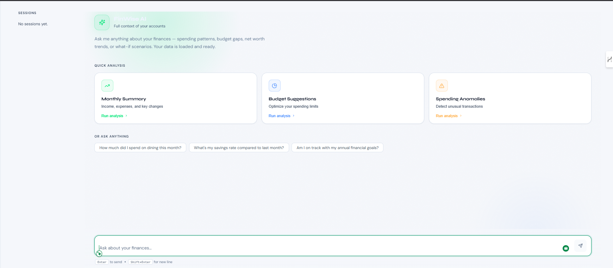
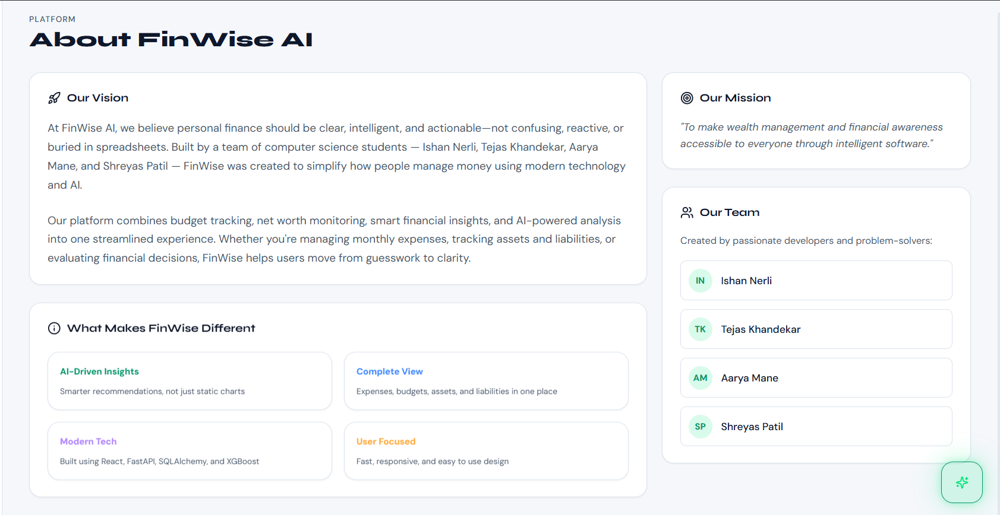
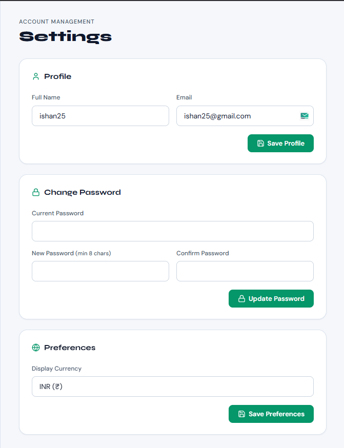

# FinWise AI Finance — Project Overview

**FinWise** is an AI-powered personal finance management web application developed as a final-year project by **Ishan Nerli, Tejas Khandekar, Aarya Mane, and Shreyas Patil**. It combines budget tracking, net worth analysis, expense management, and AI-driven insights into a single streamlined platform.

---

## 🏗️ Architecture

| Layer | Technology |
|---|---|
| **Frontend** | React 18 + Vite, Recharts, React Router, Axios, Lucide React |
| **Backend** | FastAPI (Python), SQLAlchemy ORM, Pydantic, Uvicorn |
| **Database** | SQLite (`finance_app.db`) |
| **Auth** | JWT tokens (Python-Jose), Bcrypt password hashing |
| **ML / AI** | XGBoost (pre-trained loan default classifier), Google Gemini (AI assistant) |
| **Deployment** | Cloudflare Tunnel (public HTTPS, no port forwarding required) |

---

## 📦 Key Modules

### Backend (`Backend/app/`)
- **`api/`** — 12 FastAPI route files: auth, finance, budget, assets, liabilities, loans, insights, subscriptions, categories, admin, assistant
- **`ml_models/`** — Pre-trained XGBoost pipeline for loan default probability inference
- **`services/`** — Business logic: financial calculations, health scoring, AI engine
- **`models/` + `schemas/`** — SQLAlchemy ORM models and Pydantic validation schemas

### Frontend (`finwise-frontend/src/`)
- **`pages/`** — 11 views: Dashboard, Net Worth, Budget Planner, Expenses, Loans, Insights, AI Assistant, Auth, Onboarding, Settings, About Us
- **`features/assistant/`** — AI chatbot with context-aware financial Q&A
- **`context/`** — Global state via React Context API
- **`services/`** — Axios API wrappers for all backend endpoints

---

## ✨ Core Features

1. **Financial Dashboard** — Net worth summary, monthly cash flow chart, spending split donut, recent transactions
2. **Net Worth Tracker** — Asset allocation chart with real-time APR-based monthly interest per liability
3. **Zero-Based Budget Planner** — Category budgets with weekly/monthly/yearly frequency normalisation
4. **Expense Manager** — Categorised transactions with monthly trend bar chart and category pie chart
5. **XGBoost Loan Analyzer** — Predicts loan default probability from applicant profile; outputs DTI, total interest, AI verdict, and key ML factors
6. **Financial Insights** — Composite health score (Savings Rate + Debt Ratio + Emergency Fund + Spending Control + Net Worth Growth), subscription audit, AI recommendations
7. **AI Assistant** — Context-aware chat grounded in live account data; quick-analysis prompts for monthly summary, budget suggestions, spending anomalies
8. **Settings** — Profile management, password change, display currency (INR ₹)

---

## 🖼️ Screenshots

### 1 — Financial Overview (Dashboard)


---

### 2 — Net Worth Tracker


---

### 3 — Budget Planner


---

### 4 — Expenses & Transactions


---

### 5 — XGBoost Loan Analyzer


---

### 6 — Financial Insights & Health Score


---

### 7 — AI Financial Assistant


---

### 8 — About Us Page


---

### 9 — Account Settings


---

## 🚀 Running the App

```powershell
# From project root (Windows — one command)
.\start_finwise.ps1
```

| Service | URL |
|---|---|
| Frontend | http://localhost:5173 |
| Backend API | http://localhost:8000 |
| API Docs | http://localhost:8000/docs |


> **Test credentials** — `[EMAIL_ADDRESS]` / `[PASSWORD]`
