# 📘 FinWise AI Finance

Welcome to **FinWise**, your AI-powered wealth management and budgeting companion. This repository contains the complete ecosystem, including an intelligent financial tracking backend, a responsive React frontend, and related AI assistant features.

## 📷 App Demo Preview

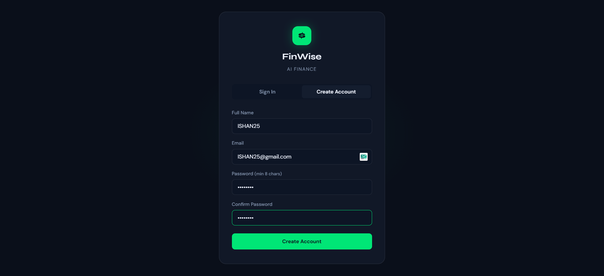
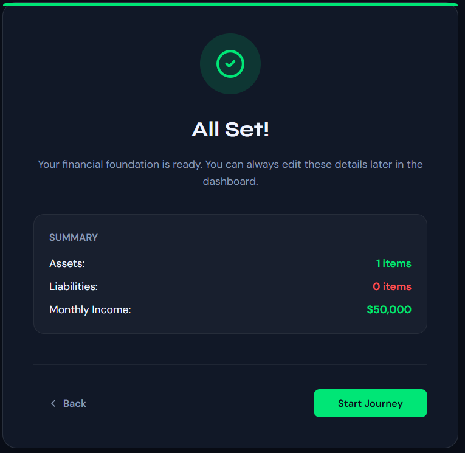
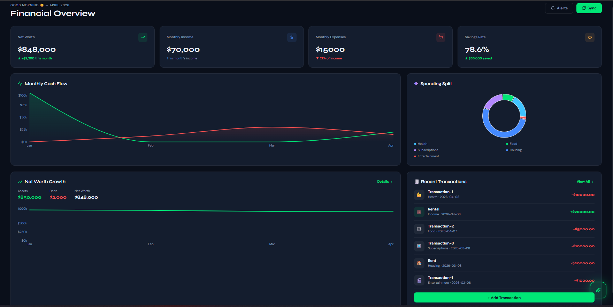
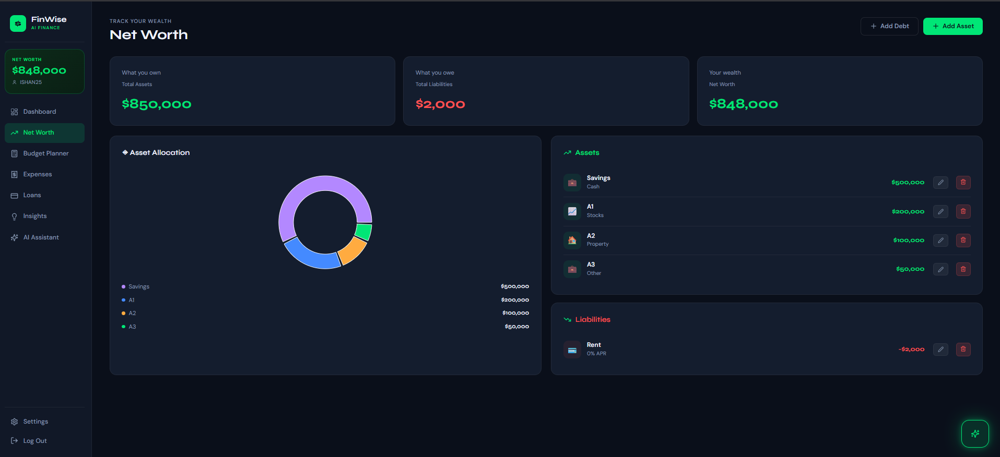
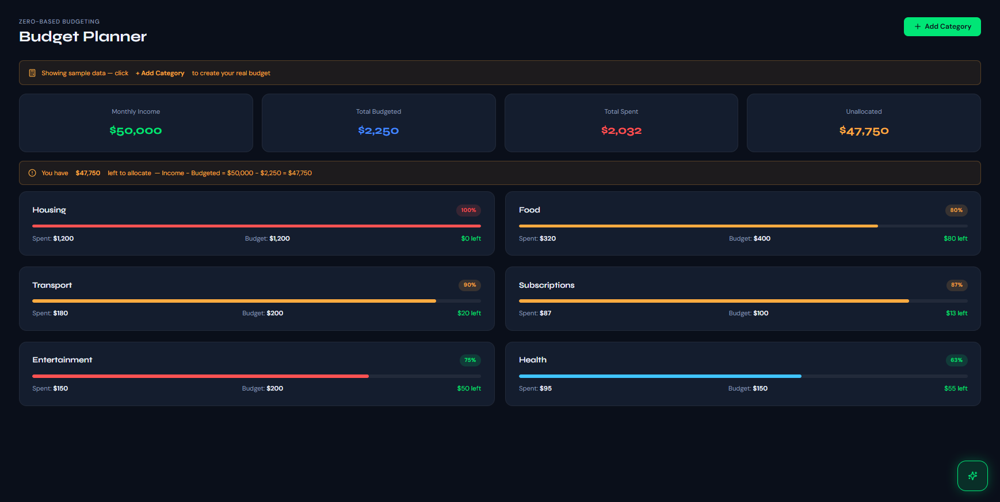
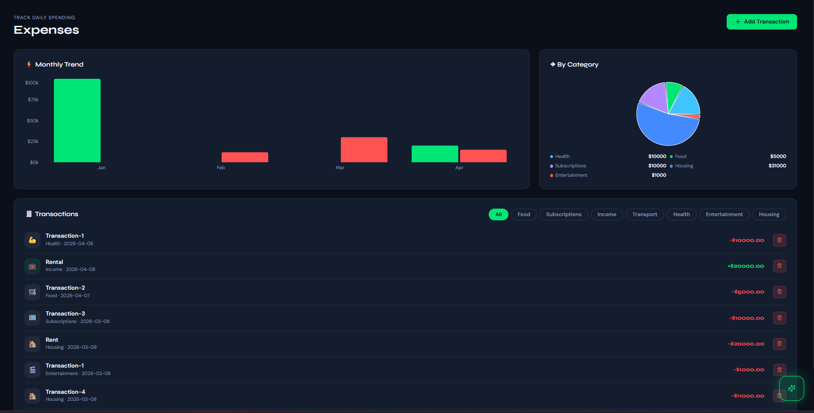
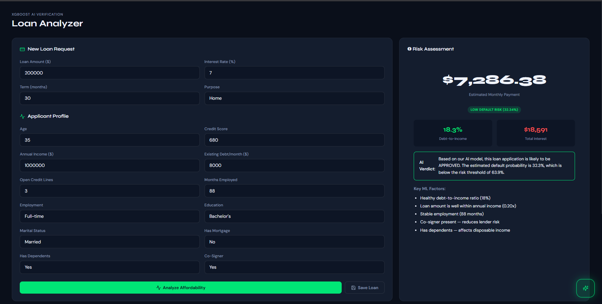
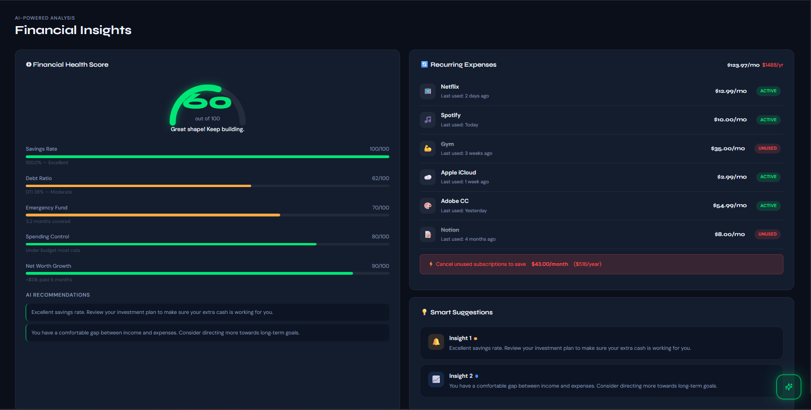
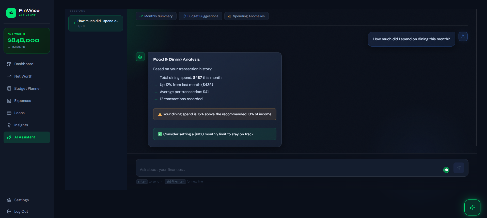
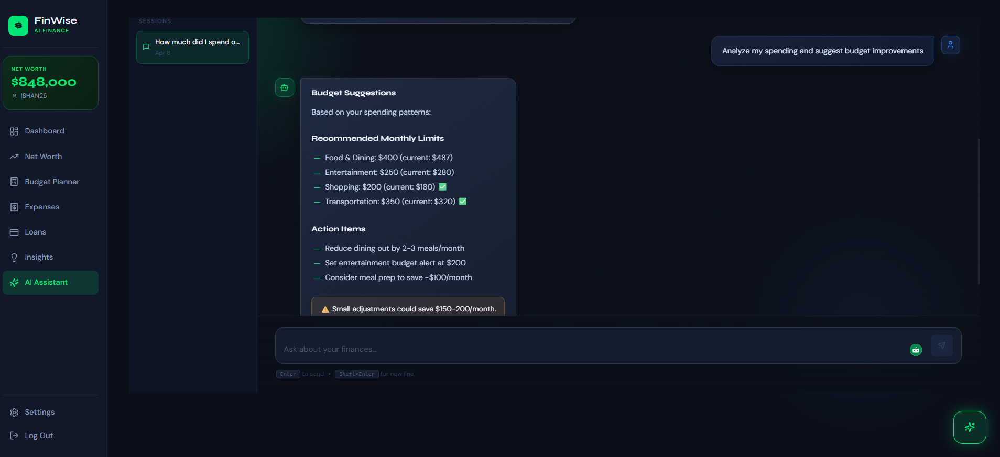
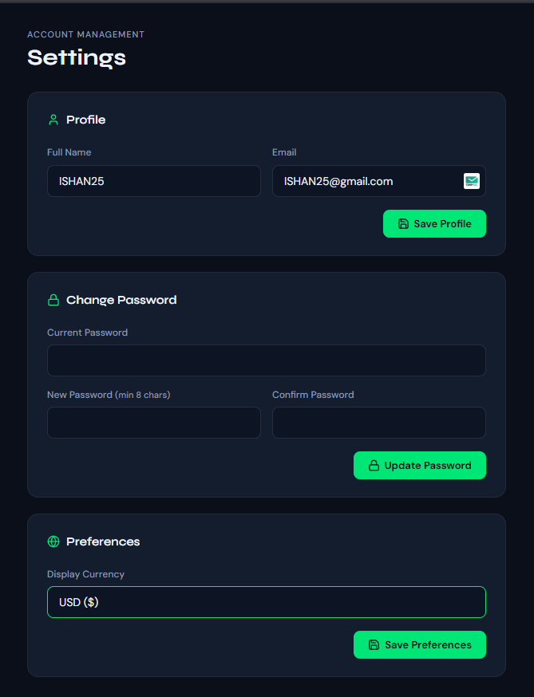

---

## 📁 Project Structure

```text
FinWise-Complete-v2-mark-2/
├── AI-assistant-FRNTD/         # AI Assistant components and prompts
│   ├── src/                    # Source code for the AI assistant interface
│   └── antigravity-prompt.md   # Base instructions for the AI assistant
│
├── Backend/                    # FastAPI Backend Application
│   ├── app/                    # Main application package
│   │   ├── api/                # API routers and endpoints
│   │   ├── core/               # Core configuration, settings, and security
│   │   ├── db/                 # Database initialization and sessions
│   │   ├── models/             # SQLAlchemy ORM models
│   │   ├── ml_models/          # XGBoost AI models and inference engines
│   │   ├── schemas/            # Pydantic data validation schemas
│   │   └── services/           # Core business logic and calculations
│   ├── requirements.txt        # Python backend dependencies
│   ├── app.main.py             # Entry point for the FastAPI server
│   └── venv/                   # Python Virtual Environment
│
├── finwise-frontend/           # React + Vite Frontend Application
│   ├── src/
│   │   ├── components/         # Reusable UI components (buttons, inputs, charts)
│   │   ├── context/            # Global state management using React Context
│   │   ├── features/           # Feature-specific modules (e.g., AI assistant)
│   │   ├── layouts/            # Page layouts like navigation and sidebars
│   │   ├── pages/              # Primary views (Dashboard, Budget, Net Worth)
│   │   ├── services/           # Axio wrappers and API integration logic
│   │   └── styles/             # Application styles and CSS
│   ├── package.json            # Node.js dependencies and scripts
│   └── vite.config.js          # Vite build and dev server configuration
│
├── MANUAL.md                   # Comprehensive User Manual (Access rules, onboarding, logic)
└── start_finwise.ps1           # Automation script to effortlessly launch both backend and frontend
```

---

## 🗑️ Non-Functional / Test Files

The following folders and files exist within the project but serve **no functional purpose** to the live, running application. They can be safely ignored or deleted if desired:

*   **`Backend/app/ml_models/*.csv`**: Files like `optimised_results.csv` and feature importance CSVs are artifacts from the XGBoost training phase and are not used during live API inference.
*   **`Backend/app/api/API-migration.md`**: Contains legacy API design notes, irrelevant strictly to application execution.

---

## 🛠️ Tech Stack

### Frontend
*   **React 18** for a fast and dynamic user interface
*   **Vite** for optimized, blazing-fast builds
*   **Recharts** for visualizing financial data and asset allocations
*   **React Router** for seamless client-side routing
*   **Axios** for smooth communication with the backend API
*   **Lucide React** for crisp, scalable icons

### Backend
*   **FastAPI** for an exceptionally fast and documented Python backend
*   **XGBoost** for intelligent machine learning loan assessment
*   **SQLAlchemy** for powerful and reliable database ORM
*   **Pydantic** for rigorous data validation and schema definitions
*   **Uvicorn** as the robust ASGI web server
*   **SQLite** for out-of-the-box local data storage
*   **Bcrypt & Python-Jose** for secure authentication and JWT tokens
*   **Cloudflare Tunnel** for secure public internet exposure without port forwarding

---

## 🚀 Getting Started

Getting FinWise up and running is designed to be effortless.

### Prerequisites
*   Node.js (v18+)
*   Python (3.9+)
*   Windows PowerShell (for the automated script)

### 🚀 Initial Setup (Fresh Clone)
If you've just cloned this repository from GitHub, you will need to do a one-time setup to install the excluded backend and frontend libraries:

1. **Frontend Dependencies**:
   Open a terminal in the `finwise-frontend` directory and run:
   ```bash
   npm install
   ```
2. **Backend Dependencies**:
   Open a terminal in the `Backend` directory, configure your virtual environment, and install dependencies:
   ```bash
   python -m venv venv
   .\venv\Scripts\activate   # Or source venv/bin/activate on Mac/Linux
   pip install -r requirements.txt
   ```

### The Easy Way (Automated Script - Windows)
1. Open a PowerShell window in the project root directory (`FinWise-Complete-v2-mark-2`).
2. Run the start script:
   ```powershell
   .\start_finwise.ps1
   ```
3. This script gracefully cleans up old blocked ports (like 8000 or 5173), verifies components, starts the backend and frontend in parallel, and **launches a Cloudflare Tunnel** to provide you with a public HTTPS URL.
4. Check the new terminal window for a `.trycloudflare.com` link to access your app from other devices (phones, tablets, etc.).

### The Manual Way
If you prefer managing the terminals yourself or are running on a non-Windows OS:

**1. Start the Backend:**
```bash
cd Backend
# Activate your virtual environment (Windows/Linux depending)
# Windows:
.\venv\Scripts\activate
# Start the server:
python -m app.main
```
*The backend API will run on `http://localhost:8000`*

**2. Start the Frontend:**
```bash
cd finwise-frontend
npm install   # If running for the first time
npm run dev
```
*The frontend will run on `http://localhost:5173`*

### 🧪 Test Credentials
Use these to explore the app with pre-populated data:
- **Email**: `ishan25@gmail.com`
- **Password**: `12345678`

---

## 📖 Using FinWise

For a detailed breakdown on how to use the application, including:
- **First-Time Onboarding**: Inputting your assets, liabilities, and income.
- **Budgeting Engine**: How to track categories natively.
- **AI Loan Analyzer**: Utilizing a trained XGBoost model to assess default risks and loan eligibility dynamically.
- **Net Worth Management**: Asset breakdown over time.
- **Authentication**: Managing secure sessions.

Please refer to the enclosed [`MANUAL.md`](./MANUAL.md) file.
